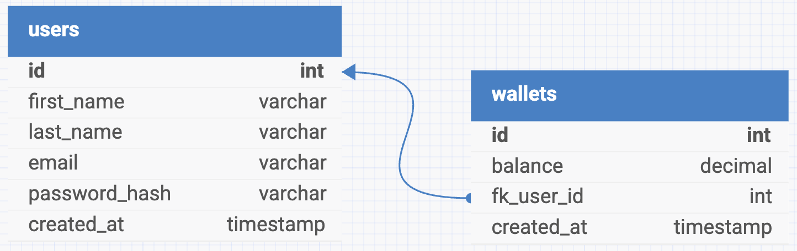

# DemoCreditWallet

DemoCreditWallet is a service for facilitating the transfer of funds between users of the service. This allows it to be used for lending and similar functions.

Users can sign up by providing the required details and then login to access the available functionality. An overview of the available endpoints follows.

## API Reference

#### User Signup

```http
  POST /api/v1/user
```

The following fields are required in a JSON body.

| Parameter   | Type     |
| :---------- | :------- |
| `email`     | `string` |
| `firstName` | `string` |
| `lastName`  | `string` |
| `password`  | `string` |

Afterwards, you can proceed with the following endpoint.

#### User Login

```http
  POST /api/v1/user/login
```

The following fields are required in a JSON body.

| Parameter  | Type     |
| :--------- | :------- |
| `email`    | `string` |
| `password` | `string` |

You will receive a JSON object response with your authentication token in the `token` field. It is expected to be in the `Authorization` header and will be required for all subsequent endpoints.

Example response:

```
{
    "token": "your-token-will-be-here"
}
```

#### Balance Check

```http
  GET /api/v1/wallet
```

Requires token in Authorization header.

Returns the current balance of the user.

Example response:

```
{
    "balance": "0.00"
}
```

#### Funds Deposit

```http
  POST /api/v1/wallet/deposit
```

Requires token in Authorization header.

The following field is required in a JSON body.

| Parameter | Type               |
| :-------- | :----------------- |
| `amount`  | `string \| number` |

The amount to be deposited is required as a positive number, but can also be sent as a matching string. This operation will fail if the deposit would cause the balance to exceed the account limit.

#### Funds Withdrawal

```http
  POST /api/v1/wallet/withdraw
```

Requires token in Authorization header.

The following field is required in a JSON body.

| Parameter | Type               |
| :-------- | :----------------- |
| `amount`  | `string \| number` |

The amount to be withdrawn is required as a positive number, but can also be sent as a matching string. This operation will fail if the amount is greater than that available in the user's balance.

#### Funds Transfer

```http
  POST /api/v1/wallet/transfer
```

Requires token in Authorization header.

The following fields are required in a JSON body.

| Parameter        | Type               |
| :--------------- | :----------------- |
| `amount`         | `string \| number` |
| `recipientEmail` | `string`           |

The amount to be transferred is required as a positive number, but can also be sent as a matching string. The recipient must have the sent email address in an account on the platform. This operation will fail if the amount is greater than that available in the requesting user's balance or would cause the recipient user's balance to exceed their account limit.

## Database Entity Relationship Diagram


